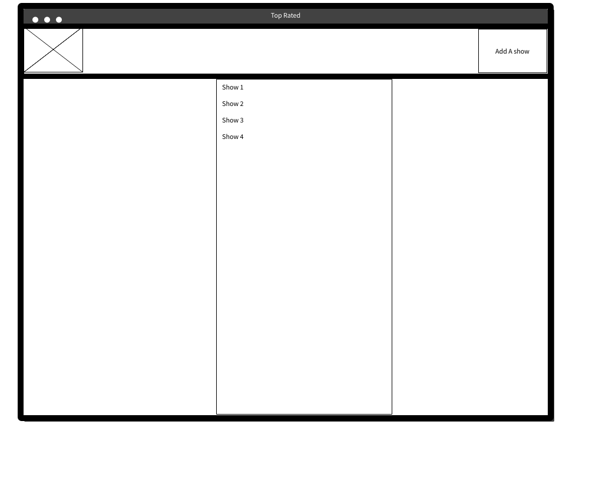
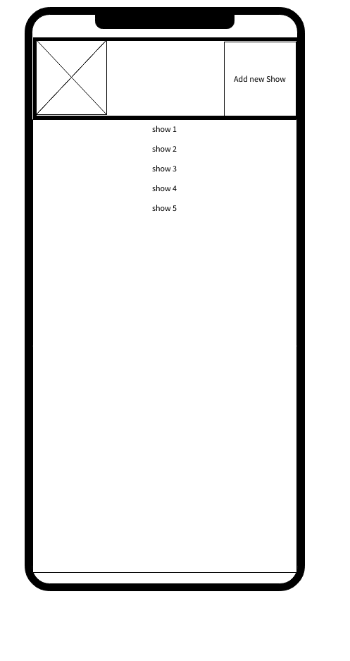
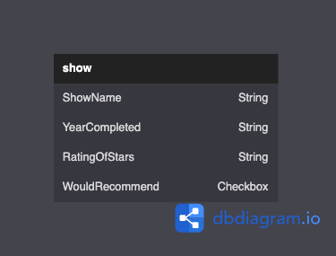

# PROJECT 2

- **Project Name:** Top Rated
- **Project By:** Ronard Nyongkah
- [**LINK TO GITHUB**](https://github.com/JoyBoyCr7/Ronard-s-Project)
- [**LINK TO DEPLOYED WEBSITE**](https://ronards-project2.onrender.com/)
- **List of Technologies used:** HTML, JS, CSS, Node, Express, EJS, Mongo
- [**LINK TO TRELLO**](https://trello.com/b/p1SVIJ2W/project2)

## Description
This app is an app that allows the user to keep track of the shows they have watched throughout the years. It allows the user to document when they completed the show and rate the show on a scale of 1 to 5.

## Mock UP of UI

## List of Backend Endpoints

| ENDPOINT | METHOD | PURPOSE |
|----------|--------|---------|
| /Shows | Get | list all Shows |
|/Shows/new | Get | Show a form to add a new show |
|/Shows/:id | Delete | Remove a show from the DB |
|/Shows/:id | Put | Update a show's data |
|/Shows | Post | Show that was created is added to DB and user is redirected |
|/Shows/:id/edit | get | Show a form prefilled with the show's current data to be edited then trigger the update route|
|/Shows/:id | get | Show one Show |

## ERD (ENTITY RELATIONSHIP DIAGRAM)

